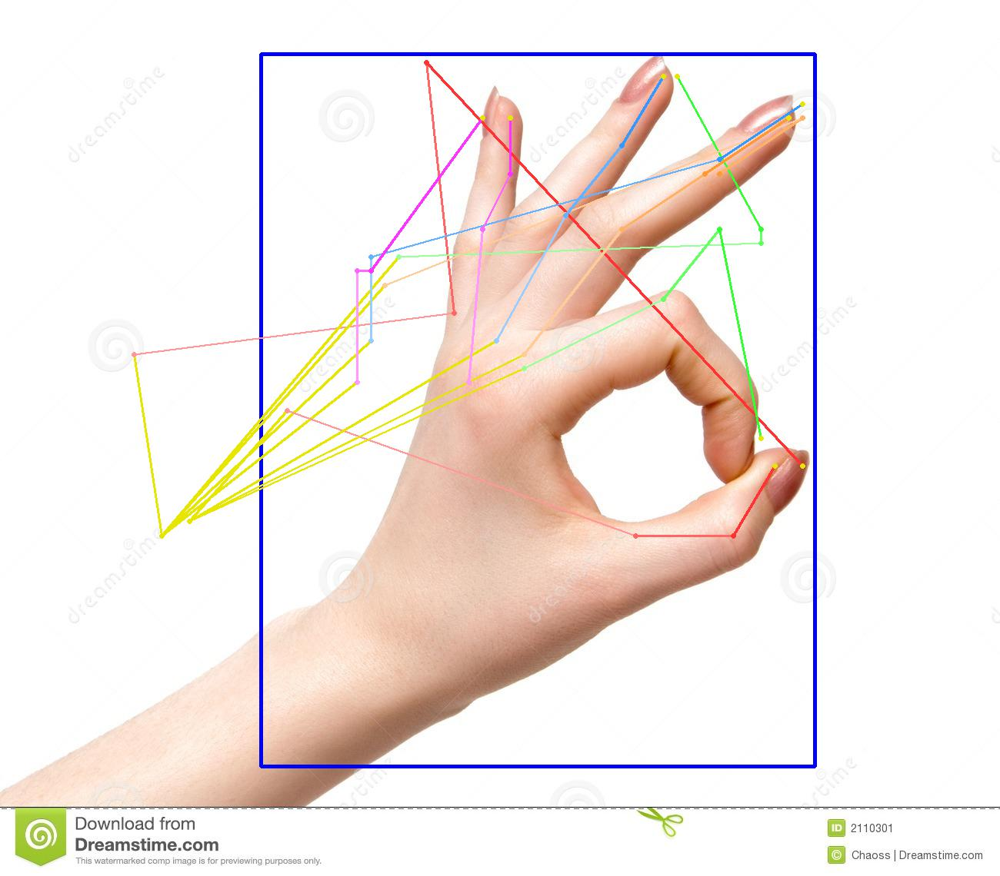

# INTERHAND2.6M PROJECT SUMMARY
**Creator: Son Thanh Nguyen - Date: Jan 29 2021**
## I. INTRODUCTION

Interhand2.6 is a project that provides a new dataset and a new approach for the hand pose estimation problem. Interhand2.6 can estimate 2D as well as 3D hand pose, but the released dataset of the authors contains images in the indoor context with a black background, which leads the result very bad in the complexity context. We will eliminate this issue by background augmentation

Results of original Interhand2.6 model on released test set:
| Test image | Test image with augmentation background | 3D pose  graph|
|:------------:|:-------:|:-------:|
||  ||
||  ||
||  ||

Results of original Interhand2.6 model on internet images:
| Test image | 3D pose  graph|
|:-------:|:-------:|
|||
|||

The above images show that the original model does not output high-quality results on the complexity background context as well as data outside the training set. In order to eliminate this issue, we continue to retrain the original model with a more complex background context.
## II. Implementation
- As introduced before, we augment the background of training images by replacing the black background with random images in the COCO dataset. The replacing will be done online with the probability of 0.5
- We continue to retrain the model by continuing to train from epoch 21.
### 1.Installation
Follow Installation guide of https://github.com/cybercore-co-ltd/ccpose.

### 2.Train and test
Follow https://github.com/facebookresearch/InterHand2.6M

## III. Results
### 1. Experiments
#### 1.1. Machine_val set
##### 1.1.1 **Test on original images of test set**
|Model |MPJPE for all hand sequences|MPJPE for single hand sequences|MPJPE for interacting hand sequences|Handedness accuracy|
|:--------:|:-------:|:--------:|:-------:|:-------:|
|Pretrained |17.38|14.69|20.34|0.9803|
|Retrained |**17.21**|**14.48**|**20.19**|**0.9867**|

##### 1.1.2 **Test on augmentation images of test set**
|Model |MPJPE for all hand sequences|MPJPE for single hand sequences|MPJPE for interacting hand sequences|Handedness accuracy|
|:--------:|:-------:|:--------:|:-------:|:-------:|
|Pretrained |30.26|21.95|39.27|0.5772|
|Retrained |**18.45**|**14.90**|**22.33**|**0.9759**|

#### 1.2. all_test set
##### 1.2.1 **Test on original images of test set**
|Model |MPJPE for all hand sequences|MPJPE for single hand sequences|MPJPE for interacting hand sequences|Handedness accuracy|
|:--------:|:-------:|:--------:|:-------:|:-------:|
|Pretrained |15.35|12.75|17.49|**0.9916**|
|Retrained |**15.09**|**12.52**|**17.21**|0.9915|

##### 1.2.2 **Test on augmentation images of test set**
|Model |MPJPE for all hand sequences|MPJPE for single hand sequences|MPJPE for interacting hand sequences|Handedness accuracy|
|:--------:|:-------:|:--------:|:-------:|:-------:|
|Pretrained |28.22|19.53|35.33|0.6362|
|Retrained |**16.52**|**13.10**|**19.33**|**0.9840**|

**Note :**
- **MPJPE**: Mean per joint position error (Smaller is better)
- **Handedness accuracy**: Accuracy of left/right hands recognition (higher is better)
### 2.Inferences examples:
| pretrained model | Retrained model|
|:------------:|:-------:|
|||
|||
|| |
|| |
||  |

| Retrained model|3D pose graph|
|:------------:|:-------:|
|||
|||
|||

## V. Conclusion
### 5.1 What we succeed.
1. We successfully reproduce InterNet model base on the original dataset.
2. Retrain the original model with augmentation data and got a better result.

### 5.2 Future Plan.
Because the training set contains a limited view of the camera, the result will be worse in other views with a different ratio, context, etc. We will try to augment data with more diversity in view and context and continue to retrain the model.
